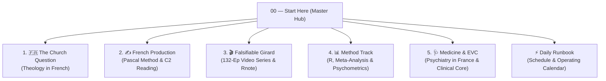

# Master Hub & Start Here

> **The Map of the Entire Vault & Life Systems.**
> This file indexes all 5 active operational tracks and points directly to the exact file you should open first in each.

---

## 🧭 The 5 Active Production Tracks

---

### 1. 🇫🇷 The Church Question (Theology in French)
* **Goal**: Resolving your theological allegiance (**Rome, Constantinople, or Alexandria**). Run entirely in French.
* **👉 Open First**: [[PARCOURS — où aller et où j'en suis]] — Your daily dashboard and reading checklist.
* **The Architecture**: [[00 - Le Plan]] — The 8 question-based modules and rules.
* **The Reading Engine**: [[Lire pour l'argument]] (3-column analysis: *Fondé / Pas encore / Présupposé*).
* **The Primary Texts (FR)**: Located in `~/library/theology/05-francais/textes-courts/` and `06-extraits/` (also on Desktop at `~/Desktop/Theology Primary Texts (FR)` and `~/Desktop/Theology Extracts (PDF)`).
  * [[M1 - Un seul Dieu non pas trois]] · [[M1a - Montrer la circonscription]] · [[M1b - L'argument pas à pas]]
  * [[Léon le Grand - Tome à Flavien (449, FR)]] · [[Définition de Chalcédoine (451)]]
  * [[Augustin - De la Trinité, Livre XV (FR)]]

---

### 2. ✍️ French Production & Reading Methods
* **Goal**: Transitioning from passive C1 reading to authoritative spoken & written C2 production (*"Steal the joints, not the content"*).
* **👉 Open First**: [[Pascal Reconstruction — French Production Method]] — The 5-pass retrieval loop on Pascal's *Pensées* (Br. 139, 100, 358).
* **The Reading Plan**: [[French Reading Plan — 30 Books to C2]] — 2.2M words across Girard, Camus, Bernanos, and Simone Weil.
* **Error Log**: [[Journal des écarts — lecture]] — Logging broken connectors (*les articulations*).
* **Reference**: [[FRENCH GOALS]] · [[Bookstores DZ — French Buy List]] · [[Histoire Francais]].

---

### 3. 🎬 Falsifiable Girard & Video Production
* **Goal**: The 132-episode video series built from `~/Myths` (47 commits, 10 pre-registered rounds testing Girardian scapegoat theory in code).
* **👉 Open First**: [[Series Index]] — Master index and statistics across all 8 seasons.
* **The Episode Status**: [[Episode Status]] — Detailed 91-episode audit table enforcing the 6-part register rule.
* **The Rnote Board Spec**: [[Filming Doc Spec - Building the Rnote Board]] — Designing A4 visual boards with cold evidence, hot delivery triggers, and live drawing zones.
* **Rnote PDFs Ready to Film**: Located at `~/Rnote/Falsifiable Girard/` (and on Desktop at `~/Desktop/Falsifiable Girard (Rnote PDFs)`).
* **Other Series**: [[James]] · [[Psalms as Aiming Tools - Reading Plan and Video Mine]] · [[THE MASTER GIRARD × AUTOBIOGRAPHY EPISODE MAP]].

---

### 4. 📊 Method Track: Evidence Synthesis, Meta-Analysis & Psychometrics
* **Goal**: Mastering biostatistics in R, systematic reviews, and measurement critique in psychiatry.
* **👉 Open First**: [[Method Track — Modules and Books]] — The 18-module curriculum across Track A (The Hands), Track B (The Eyes), and Track C (Psychometrics & Epistemology).
* **The Strategic Rationale**: [[Side Quest — What to Study Alongside the EVC]] — The Falissard benchmark and the rare intersection between phenomenology and statistics.
* **Dataset on Disk**: Cipriani 2018 GRISELDA database at `~/method/data/cipriani_griselda_lancet2018.xlsx`.

---

### 5. 🩺 Medicine & EVC (Psychiatry Route)
* **Goal**: The medical career runway leading to French residency and clinical psychiatric practice.
* **👉 Open First**: [[Plan Till EVC PSYCHIATRY]] — Strategic roadmap from Algerian graduation to FFI and EVC concours.
* **Clinical Briefing**: [[1. Strategic Context]] — 8-part August clinical briefing and session structures.

---

### ⚡ Daily Operating System
* **👉 Open Daily**: [[00 — Runbook]] — The standing daily schedule, weekly calendar, drop order, and the Sunday review dial.

---

## 🗂️ Complete Vault Map (Folders 00 to 15)

### The Case
* **`00 - Index/`** — [[01 - The Whole Argument]] (the spine: one test, five corpora, and the standing falsifiers) · [[00 - Master Index]] (Reading order for arguments 01 to 08).
* **`01 - Prophecy/`** (17) — Messianic case from Tanakh (Daniel 9, Psalm 110, Isaiah 53).
* **`02 - Temple Argument/`** (1) — First century messianic expectation.
* **`03 - Historical Evidence/`** (18) — Canon formation, Dead Sea Scrolls, textual variants, [[Vindicatory Miracles — The Catholic Case and Its Missing Control]].
* **`04 - Resurrection/`** (6) — Minimal facts, pre-Pauline creed, crucifixion case.
* **`05- Jewish History/`** (6) — Talmudic exchanges and Ehrman analysis.
* **`06 - Philosophy/`** (15) — Consciousness, morality, original sin, person vs nature, [[The Communication Objection]].
* **`07 - Theological issues/`** (20) — Trinity, Paraclete, and **`The Church Question/`** (French track).
* **`08 - Islam Debates/`** (71) — Islamic Dilemma, Quranic textual variants, Ibn Taymiyya critique.

### The Work
* **`09 - Purpose/`** (8) — [[00 — Runbook]] and operating systems.
* **`10 - Publishable Essays/`** (24) — Long-form prose and literary reading notes (*Books/*).
* **`11 - Video Production/`** (140) — Channel architecture, Falsifiable Girard, James, Psalms.
* **`12 - Medicine & EVC/`** (13) — Psychiatry route and [[Method Track — Modules and Books]].
* **`13 - Writing/`** (237) — Fiction pipeline, short stories, and daily logs.
* **`14 - Method & Memory/`** (13) — Memory systems, Pascal method, reading fiches, forensic records.
* **`15 - Reference/`** (4) — JesusMarie library, Greek/Latin/French lexicon, book buy lists.

### The Archive
* **`The OLD life/`** (550) — Archived copywriting business and legacy journals (hidden).

---

## 🖥️ Direct System Shortcuts

| Shortcut on Your Desktop | Targets | Purpose |
| :--- | :--- | :--- |
| **`Theology Extracts (PDF)`** | `~/library/theology/06-extraits/` | Trimmed 5–20 page Patristic PDF extracts for French reading |
| **`Theology Primary Texts (FR)`** | `~/library/theology/05-francais/textes-courts/` | Full French primary source texts (Gregory of Nyssa, Leo, Cyril, Irenaeus) |
| **`Falsifiable Girard (Rnote PDFs)`** | `~/Rnote/Falsifiable Girard/` | 91 pre-rendered A4 episode PDFs ready to import into Rnote for filming |
